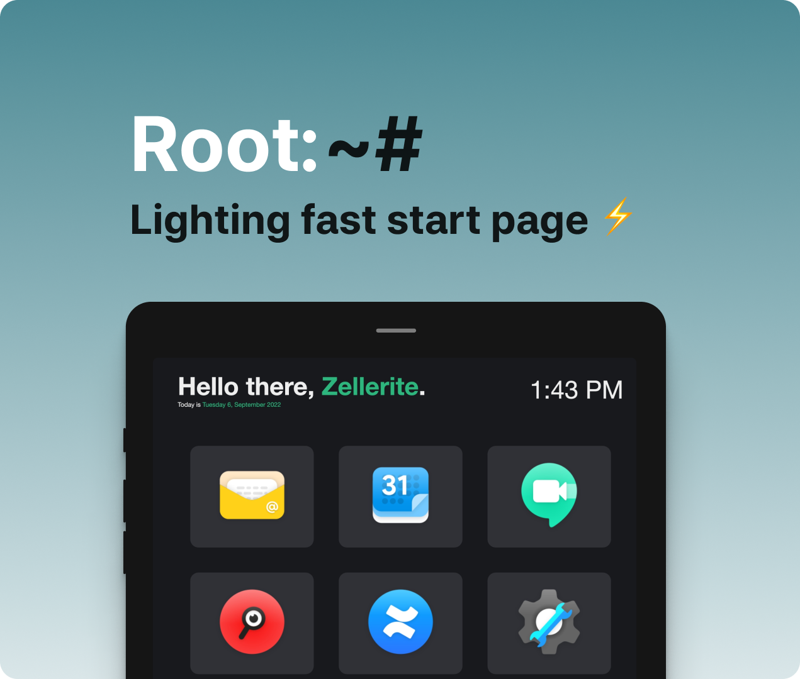

### Root is a start-page aimed at simplicity and elegance

This project is blazing fast :zap:, it only contains html, css and javascript files.

## Customizing

Root was created to be lightweight, fast and easy to customize.

### Changing Colors

To change the colors used in the startpage edit `styles.css`.

```css
:root {
  --primary: #dd2e44;
  --text-light: #eeeeee;
  --background: #1e1c21;
  --background-light: #333138;
}
```

### Changin Name and Adding Custom Cards

> This project now uses PNGs as icons. There are icons provided in ../root-startpage/icons folder   

To change the default name and edit the cards, edit `app.js`. It should look something like this:

```js
const NAME = "John Doe";

const CARDS = [
  {
    name: "Gmail",
    link: "https://mail.google.com/mail/u/0/#inbox",
    img: "../root-startpage/icons/email.png"
  },
```

To add a new card, just append a new object to the `CARDS` constant. The object should look something like this:

```js
{
  name: "<Webpage Name>",
  link: "<Webpage Link>"
  img: "../root-startpage/icons/icon.png"
},
```
